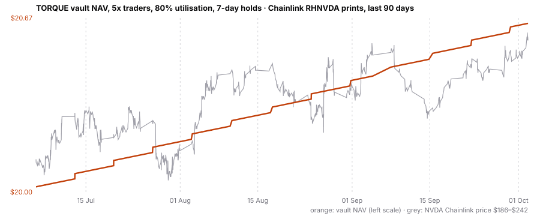

# LP backtest: TORQUE's vault over 90 days of real NVDA prices

Generated by `research/lp_backtest.py` on 2026-10-03. Prices: every Chainlink RHNVDA/USD print on Robinhood Chain from 2026-07-06 to 2026-10-02 (979 prints, 88.7 days), the feed TORQUE reads. Knock-outs can only fire at a fresh print, so this is the path the contract would have acted on, weekend gaps included.

**Demand is assumed, not measured.** Traders borrow every dollar the vault may lend, reopen as soon as a position ends, and close after a holding period. That is the best case for LP income and the most LP money at risk. Lower demand scales income down roughly in proportion (see the 40% rows).

## Result: 5x traders, 80% utilisation, 7-day holds

| Measure | Result |
|---|---|
| LP return over the window | **+3.25%** (14.1% a year) |
| Of which | $0.375 interest at 10% APR, $0.261 open fees, on a $20 vault |
| Knock-outs | 0 |
| Bad debt (LP loss) | $0.00 |
| Worst drawdown of vault NAV | 0.00% |
| Worst day for vault NAV | +0.014% (2026-09-17) |
| Mean utilisation | 78.9% |



## The worst case, as plainly as the average

**These 89 days never tested the floor.** NVDA rose from $196.29 to $235.00. Its worst fall was -11.3% in seven days (2026-07-22 to 2026-07-29). A 5x position is knocked out at -16% and the LP only loses if one gap goes past -20%. The worst move between two consecutive prints was -1.41%. The feed went quiet for over 12 hours 26 times, so opens would have paused: 12 weekends or holidays (longest 78 h, Fri 04 Sep to Tue 08 Sep) and 14 quiet weekday stretches when NVDA moved too little to trigger a print (longest 21 h). The biggest price move across any silence was -1.12%.

So the zero losses above are this window's, not a guarantee. What matters to an LP is a single gap straight through a position's knock-out level, with no print in between. This table shows the LP loss per $1 lent to a fresh position when that happens (sale 0.2% below the print):

| Leverage | Knocked out at | Worth zero at | Gap -10% | Gap -15% | Gap -20% | Gap -25% | Gap -30% | Gap -40% |
|---|---|---|---|---|---|---|---|---|
| 2x | -48% | -50% | none | none | none | none | none | none |
| 3x | -30% | -33% | none | none | none | none | none | 10.2¢ |
| 4x | -21% | -25% | none | none | none | 0.2¢ | 6.9¢ | 20.2¢ |
| 5x | -16% | -20% | none | none | 0.2¢ | 6.4¢ | 12.7¢ | 25.1¢ |

At 80% utilisation with every loan at 5x, a single gap of -25% would cost the vault 5.1% of its assets, -30% would cost 10.1% and -40% would cost 20.1%. For scale: NVDA's worst day in recent years was a fall of about 17% (27 January 2025). At 5x that knocks positions out and costs the LP nothing; it takes a gap beyond about 20% to reach LP money.

## Across leverage, utilisation and holding time

| Leverage | Utilisation target | Hold | LP return | A year | Knock-outs | Bad debt | Mean utilisation | Days a cap refused an open |
|---|---|---|---|---|---|---|---|---|
| 2x | 40% | 7 d | +2.01% | 8.6% | 0 | $0.00 | 39.7% | 0 |
| 2x | 40% | 30 d | +1.21% | 5.1% | 0 | $0.00 | 39.8% | 0 |
| 2x | 80% | 7 d | +3.52% | 15.3% | 0 | $0.00 | 68.9% | 64 |
| 2x | 80% | 30 d | +2.12% | 9.0% | 0 | $0.00 | 69.3% | 64 |
| 3x | 40% | 7 d | +1.75% | 7.4% | 0 | $0.00 | 39.7% | 0 |
| 3x | 40% | 30 d | +1.15% | 4.8% | 0 | $0.00 | 39.8% | 0 |
| 3x | 80% | 7 d | +3.51% | 15.2% | 0 | $0.00 | 78.8% | 0 |
| 3x | 80% | 30 d | +2.31% | 9.8% | 0 | $0.00 | 79.2% | 0 |
| 4x | 40% | 7 d | +1.67% | 7.0% | 0 | $0.00 | 39.7% | 0 |
| 4x | 40% | 30 d | +1.13% | 4.7% | 0 | $0.00 | 39.8% | 0 |
| 4x | 80% | 7 d | +3.34% | 14.5% | 0 | $0.00 | 78.9% | 0 |
| 4x | 80% | 30 d | +2.27% | 9.7% | 0 | $0.00 | 79.2% | 0 |
| 5x | 40% | 7 d | +1.63% | 6.9% | 0 | $0.00 | 39.7% | 0 |
| 5x | 40% | 30 d | +1.12% | 4.7% | 0 | $0.00 | 39.8% | 0 |
| 5x | 80% | 7 d | +3.25% | 14.1% | 0 | $0.00 | 78.9% | 0 |
| 5x | 80% | 30 d | +2.25% | 9.6% | 0 | $0.00 | 79.2% | 0 |

## When a cap binds

At 2x, the $30 open-interest cap binds before the 80% utilisation limit: a 2x position's notional is twice its loan, so lending $16 would need $32 of open interest. In the 2x / 80% run the cap refused an open on 64 days and utilisation topped out near 69%. From 3x up the 80% utilisation limit is the only constraint, and it binds by construction, because demand is assumed to fill it. The $20 vault cap is the buildathon limit; every figure here is a percentage, so it scales with the vault. The open question is demand, not the cap.

## What this does not say

- Demand is assumed (above). Interest is 10% APR on the loan, as the contract charges, and the open fee is 0.10% of notional, paid to the vault.
- Sales into the pool are taken 0.2% below the print. The mainnet-fork sandwich runs filled 0.10-0.17% from Chainlink.
- The pool check (check 2) is not replayed: opens are only tested against check 1, a print in the last 12 hours.
- An owner can close only when the sale covers the debt, as the contract requires; otherwise the position runs until knocked out.
- 24 early rounds (22-23 June, before this window) report a different scale and are excluded; they are listed in `lp-backtest.json`.

## Re-run it

```
python3 research/lp_backtest.py             # uses research/data/rhnvda_rounds.csv
python3 research/lp_backtest.py --refresh   # refetches every round from chain (RH_RPC_URL optional)
```

Outputs: `research/lp-backtest.json` (every scenario and knock-out event), `research/data/lp_backtest_nav_5x_80pct_7d.csv` (the NAV series), `research/lp-backtest-nav.svg`.
